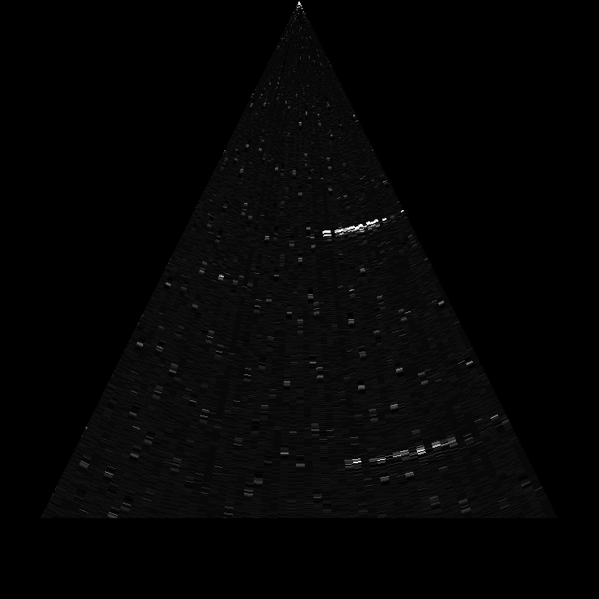

# The Murgen open-source ultrasound imaging dev-kit 

## What is this ?

Getting a home-made open-source ultrasound machine (dev-kit) up and running in your garage / hackerspace / fablab for less than 500$ (want the bolts and nuts of the murgen-based prototype ? Read a more complete [ReadMeMore.md](ReadMeMore.md) and in general the [murgen repo](https://github.com/kelu124/murgen-dev-kit/) ). 

For a full overview of the adventure, visit our [Hackaday page](https://hackaday.io/project/9281-murgen) =)

## Getting the rough rough first image
We've got **our first ultrasound image with the murgen board** =) Not a baby, mind you, but at least an echo coming from a part of a solid flat board immersed in front of the transducer. And we haven't tapped into the full capabilities of the board yet, so it can be greatly improved.

## Setting up a prototype

### Disclaimers

**Disclaimer #1**: though an engineer, this project is the first of its sort, we never did something related. Bear with us, and the discovery process – we’re happy to learn on the way =)

**Disclaimer #2**: ultrasound raises questions. In case you build a scanner, use caution and good sense!

### How-to start

Time to get some shopping done !
* Get a murgen dev-kit: 140€ in electronics + PCB. Or 100€ with the components to put on a breadboard =)
* Get a BitScope: 150€
* Get a transducer : 110€ for brand new adaptaed ones, ~100€ for one found on ebay and hacking it
* Get a Trinket Pro / Arduino : 10€
* Get some small electronics (breadboard, cables et al) : 20€
* Misc (Pizza, Beer, and a donation to Murgen): 15€

**_Total spent_: 400€ to 450€**

### Setup
#### Connections

* Connect the BitScope Chan A to Trinket Pin 11, and Chan B to Tests Points2 and 3.
* Connect the trinket pins 12 and 13 to a 5-to-3V convertor (or double invertor), then to the board USPP and USPN pins.
* Bring power to the board (GND, 5V, 3.3V) - the board uses ~150mA at 5V, so you can use a breadboard alim (see IMG_2413 below).

#### Assembling the Trinket and the Murgen boards.

#### Mounting the piezo on the servo, controlled by the trinket

### User’s Quick-Start Guide

Just Install the following:
* BitScope BitLib
* python math tools
* something to code arduino
* Clone the murgen repo TOADD:LIEN

You're good to go !

### Learn more : the lab log
- [A more complete ReadMe](ReadMe.more) : Information, and more, with a focus on the electronic part of the project
- [Session 1](Session_1.md) : Powering the board, power use, first (bad) trigging and echoes (06 March 2016)
- [Session 2](Session_2.md) : Non-controlled pulsing, inverters, better echoes (11 March 2016)
- [Session 3](Session_3.md) : Getting controlled pulsing, but width not controlled (15 March 2016)
- [Session 4](Session_4.md) : Width of the pulses is getting controlled =) (19 March 2016)
- [Session 4b](Session_4b.md) : Simple data visualisation with BitScope (19 March 2016)
- [Session 5](Session_5.md) : moving the transducer to get the first image ! (20 March 2016)

## FAQ

### Typical Application

Playing with a broken transducer in a haribo sweet box to see if you can hack ultrasounds.

### Software / Firmware Summary

Up to v1.0, we're still playing with the board, so there's not interface with the BBB.

However, there's a series of tools to play with the board, one of which being the bitscope, a bit more handy than the redpitaya that the main echopen project uses, and though it is less precise, we do have less issues (trigging, memory, ...) with it.

### What is the timeline?
The murgen investigation had started in September 2015, but following a meetup at echopen’s HQ in Paris end of November, it had been activated again. The objective was to get a first functional prototype by February 2015, but this deadline was then fixed to March 24th, 2016, on which date murgen will be presented.

# Team

## Acknowledgement

*Thanks to Jerome, Farad, Vincent obviously
*Thanks to Murgen, Sofian, Amit, Emmanuel, Florent, Bertrand & PHH, Mike in a way, list goes on !
*Thanks to echOpen for the environment, wifi and coffee =)

## Stay connected

* Read the the Hackday Blog of the fork !
* Explore [echOpen’s general wiki](http://echopen.org)
* Suscribe to the mailing list at all@murgen.echopen.org
* Or wander around the rest of echOpen's [GitHub repos](https://github.com/echopen/)
* Meet us on the social networks ?
** Join our [Facebook group](https://www.facebook.com/groups/echopen/).
** Twitter: follow [echOpenorg](http://twitter.com/echopenorg/).
* Meet us physically on friday at our apéros =)

# License

The Murgen project and its prototypes are open hardware, and working with open-hardware components.

Licensed under TAPR Open Hardware License (www.tapr.org/OHL)

Copyright Murgen and Kelu124 (murgen@echopen.org , luc@echopen.org / kelu124@gmail.com ) 2015-2016
