# Session 3 - 15 March 2016
## Other sessions

- [Session 1](Session_1.md) : Powering the board, power use, first (bad) trigging and echoes (06 March 2016)
- [Session 2](Session_2.md) : Non-controlled pulsing, inverters, better echoes (11 March 2016)
- [Session 3](Session_3.md) : Getting controlled pulsing, but width not controlled (15 March 2016)
- [Session 4](Session_4.md) : Width of the pulses is getting controlled =) (19 March 2016)
- [Session 4b](Session_4b.md) : Simple data visualisation with BitScope (19 March 2016)
- [Session 5](Session_5.md) : moving the transducer to get the first image (20 March 2016)
- [Session 6](Session_6.md) : ***Getting a clinically usable image*** (28 March 2016)
- [Session 7](Session_7.md) : Getting cleaner images - code improvements  (3 April 2016)

## Today

### ^^
_ Getting nicer pulses._

### TL;DR
- Managed to switch on and off the HV with USPP and USPN.
- With a 7.5us wide pulse, we see two echoes separated by 7.5us, hence the double echoes for switching on and off the transducer.

## Technical points
### Setup
#### Overall setup
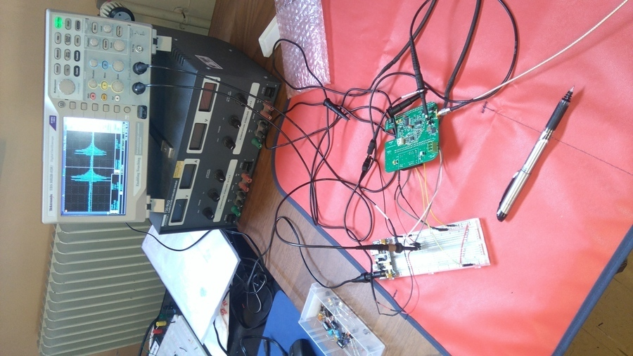
#### Transducer for a reflection
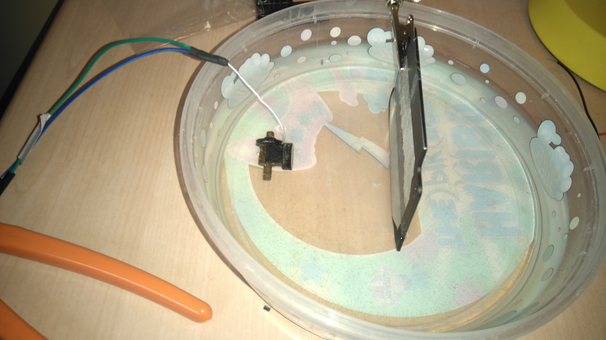

### Pulser: the HV7360

- Same setup as [Session 1](Session_1.md) and [Session 2](Session_2.md).
- The issue is that the two pulses were not controlled.. so we'll need to find something to synchronise these two, with a 150ns delay..

### Discussion and issues
#### Discussion
- High pulses: from a small pulse, echoes are amplified to a 1.54V , on an average of ~0V.
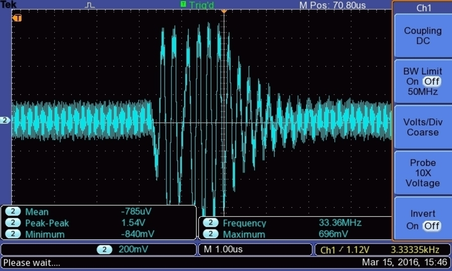
- Need to get a better pulser!

#### Issues
- Tests were done without having put the DAC inputs to GND. That may lead to some issues in reproductibility.
- Need to document the role of Jumper 1 more precisely.
- Let's try to get images from only 2/3, trigging from an external source?
--Without SPI control of the DAC
--With SPI
- We can't get anything at the TP 5/6 signal..
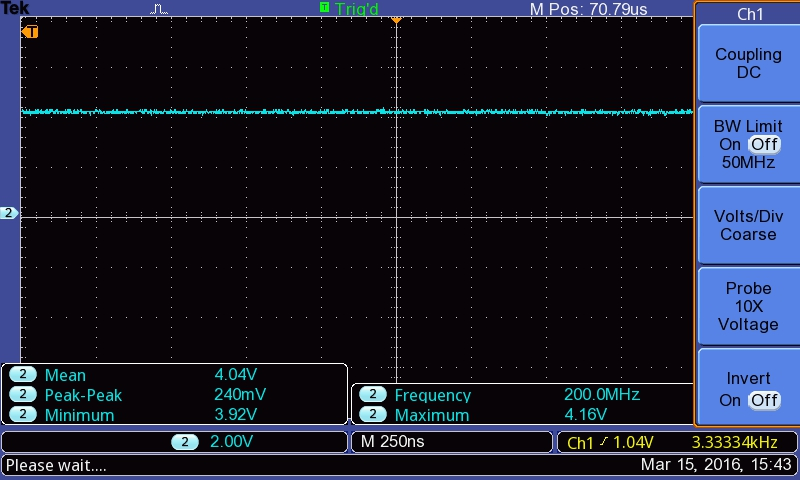

## Images
### Moving along the chain of capture
#### Before the MD0100
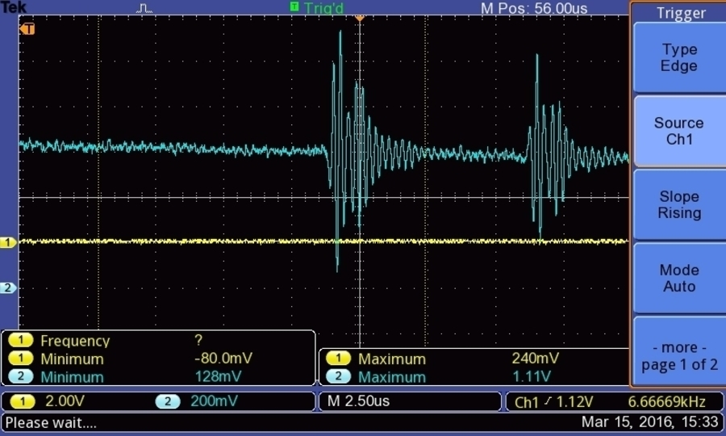
#### After the MD0100

#### After the LC after the MD0100
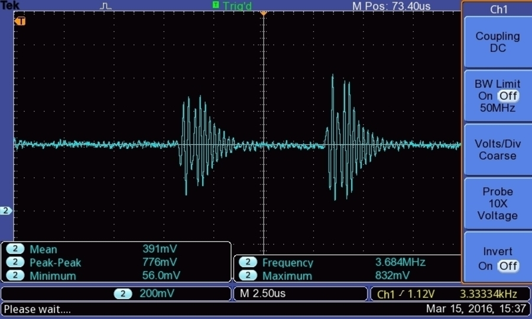
#### After the TGV (points 2/3) with Jumper on gain low
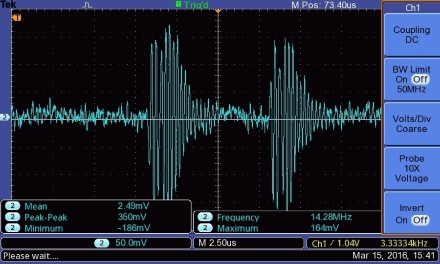
#### After the TGV (points 2/3) with Jumper on gain high

#### Before the transformer (TP 5/6)

### Controlling the pulse width
#### Trigging without USPN
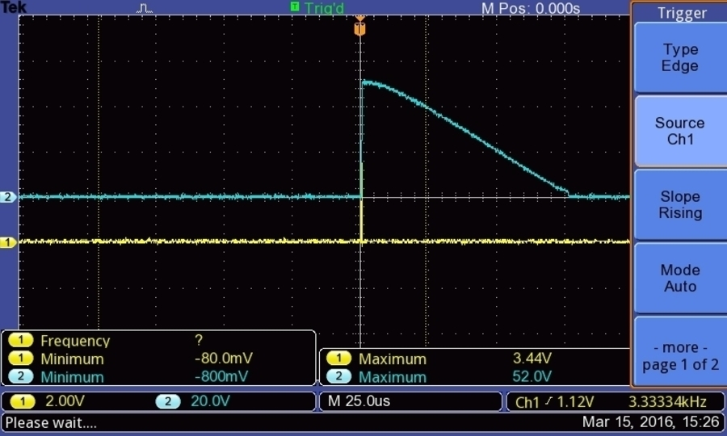
#### Triggin with USPN
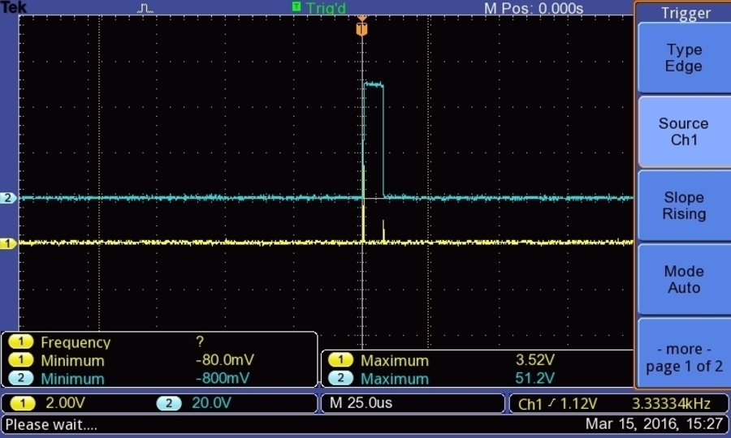
### Details of the controls
#### Trigging on with USPP
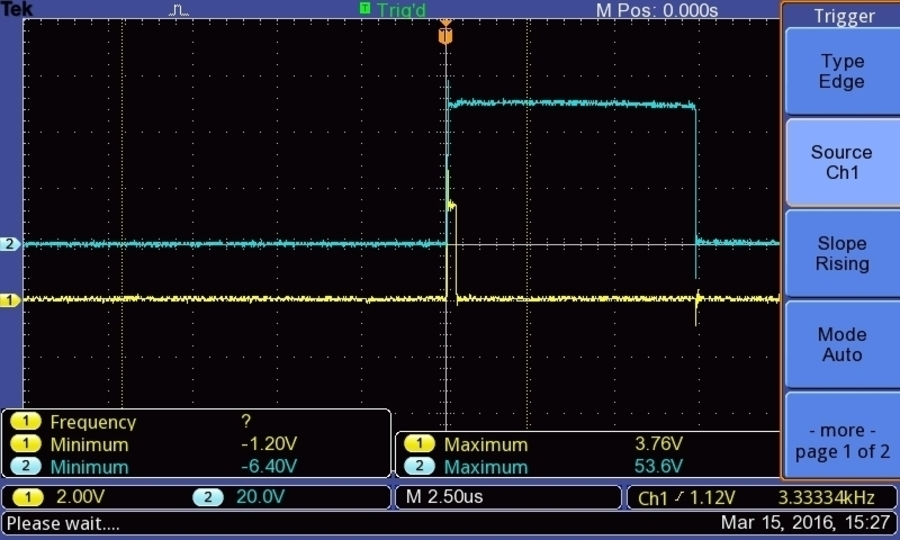
#### Trigging off with USPN
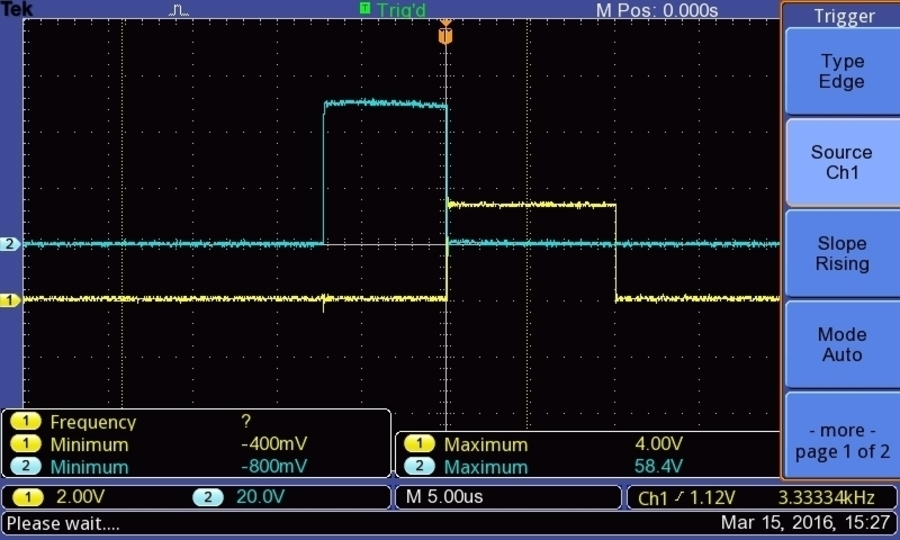
### Plugging the transducer
#### Trigging without transducer

#### Trigging with the transducer
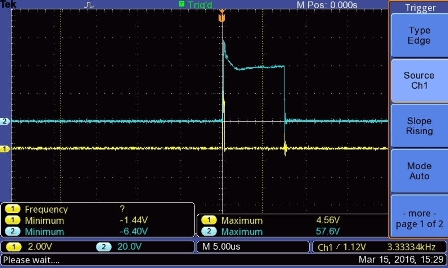

