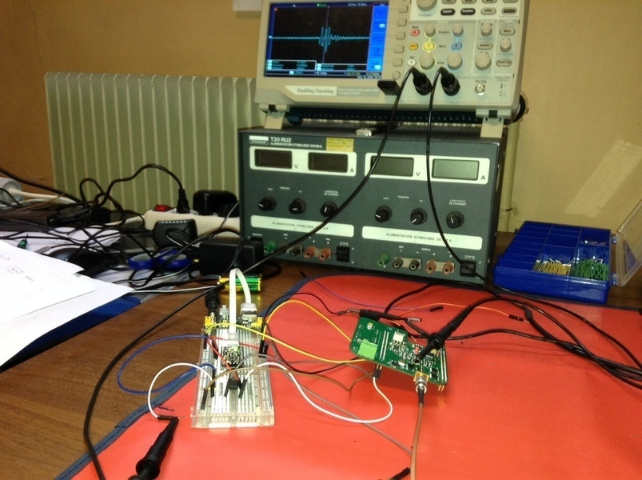
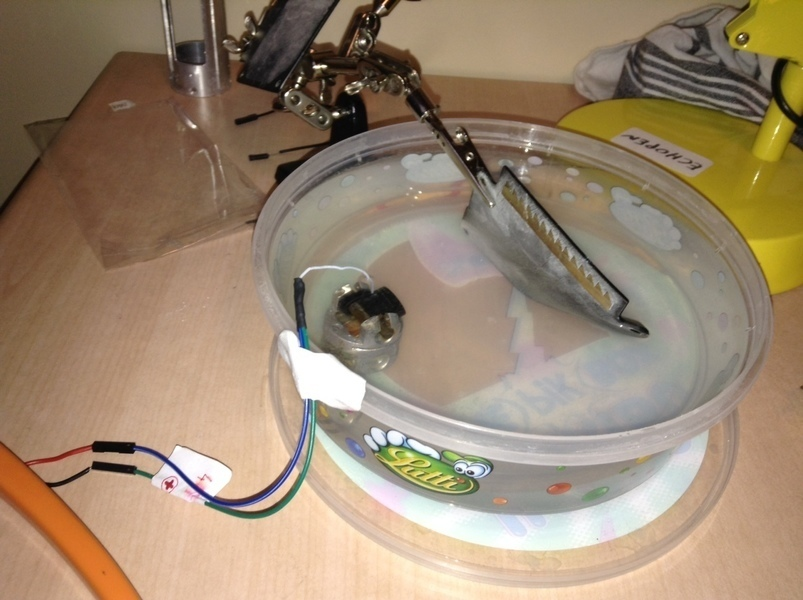
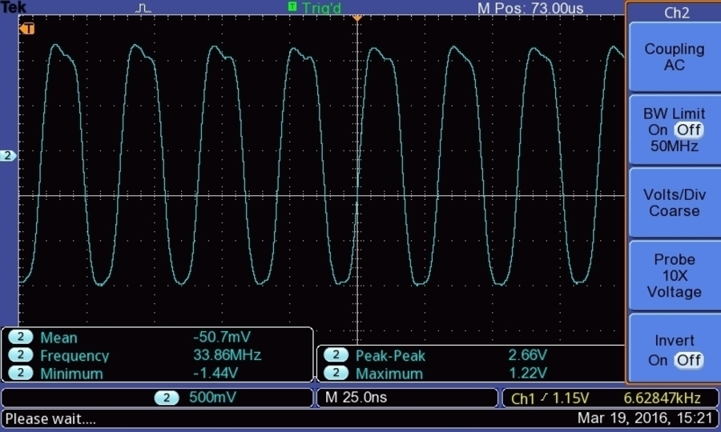
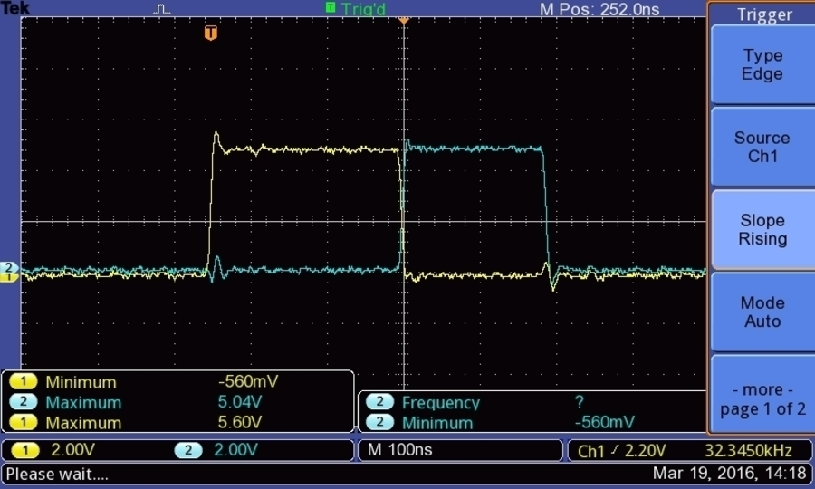
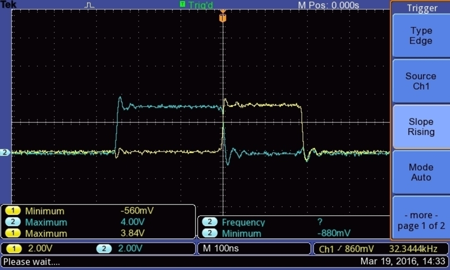
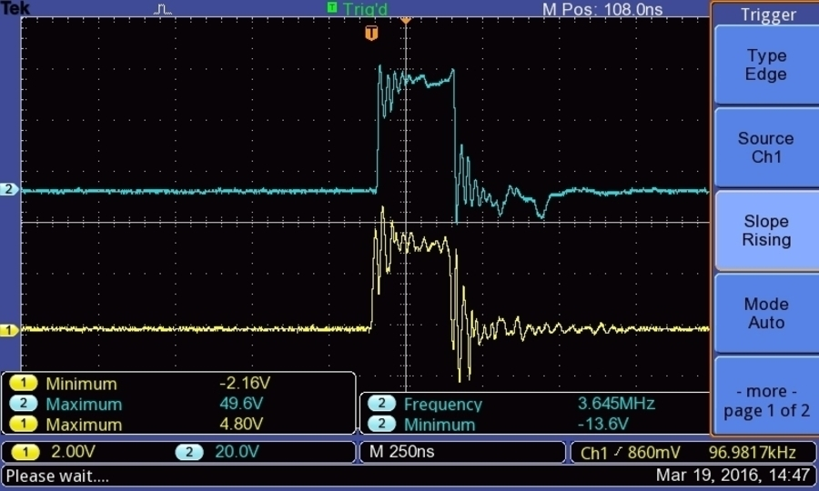
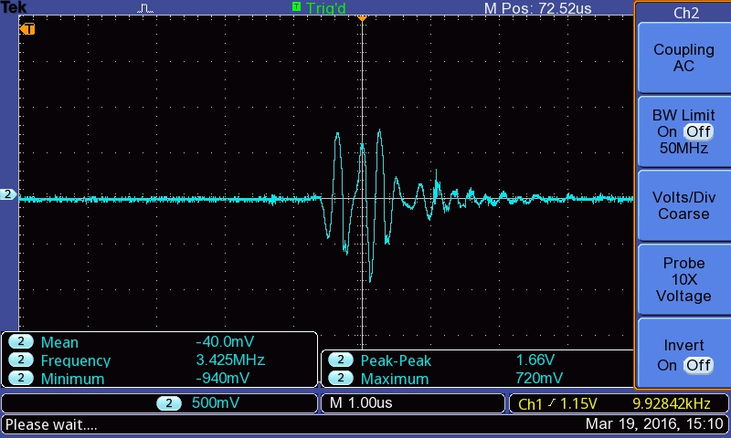
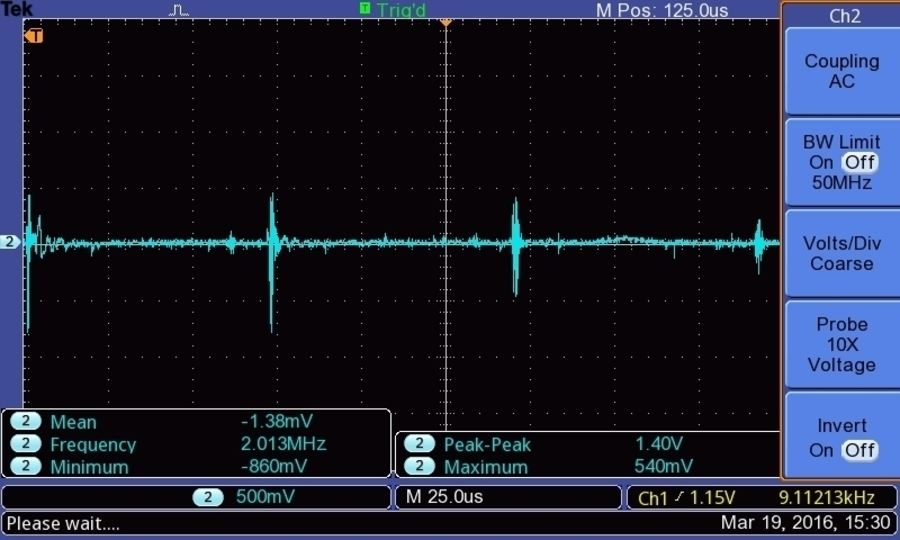
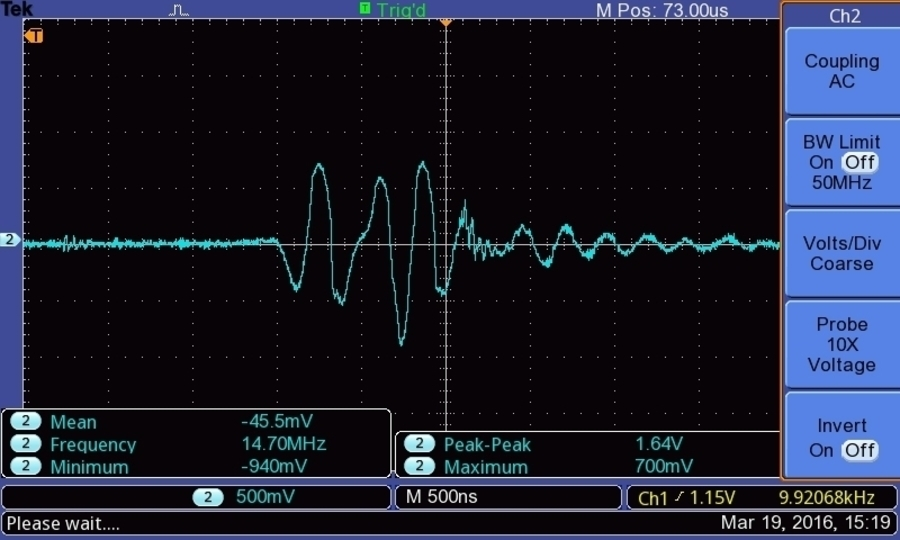
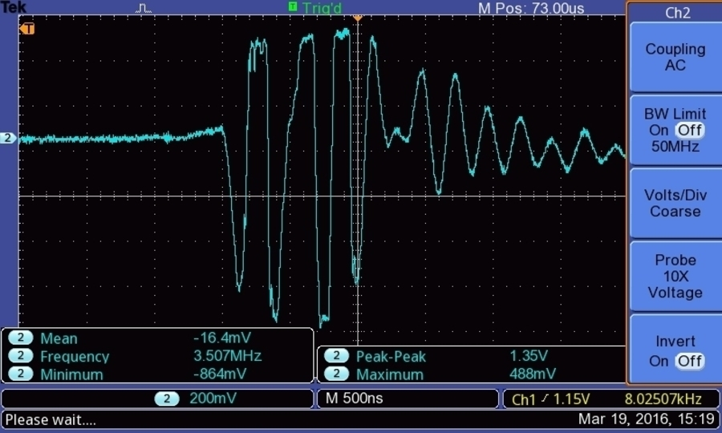

# Session 4 - 19 March 2016
## Other sessions

- [Session 1](Session_1.md) : Powering the board, power use, first (bad) trigging and echoes (06 March 2016)
- [Session 2](Session_2.md) : Non-controlled pulsing, inverters, better echoes (11 March 2016)
- [Session 3](Session_3.md) : Getting controlled pulsing, but width not controlled (15 March 2016)
- [Session 4b](Session_4b.md) : Simple data visualisation with BitScope (19 March 2016)
- [Session 5](Session_5.md) : moving the transducer to get the first image ! (20 March 2016)

## Today

### Goal
_ Pulsing shorter with an arduino and getting nicer pulses. _

### TL;DR
- Managing the pulser with a trinket pro
- Getting quite clean images

## Technical points
### Setup
#### Remarks 
- Same setup as [Session 1](Session_1.md) and [Session 2](Session_2.md).
- Added a TrinketPro to manage USPP and USPN, trying to solve [Session 3](Session_3.md) issues.
- We don't need external alim apart from the 5V/3.3V thingie, and no signal generation. We're making progress!

#### Overall setup



#### Transducer for a reflection



### Discussion and issues

#### Discussion

- As TEK13 shows, we do have great echoes, we manage to see up to 4 reflections.
- The pulse looks great!

#### Issues
- Some noise appears with the trinket
- We still need to clarify what happens at TP5/6 (see below). A signal at 34MHz is going out... but what is it? Should be filtered at 3.5MHz :p Is that an error from the filter RC parameters?



- Need to have a 3.3V trinket to manage the pulser control without having to buffer the controls.

--Indeed, controls were ouput at 5V. I had only an inverter under my hands, so I fed it 3.3V from the regulator, and doubly inverted the signals.

--Before:



--After:



#### Next steps
* Using BitScope to get the image
* Throwing in some movements
* Find out the TP5/6 issue

## Images
### Moving along the chain of capture
#### Outputs of the trinket - 5V

#### Pulsing, without transducer

#### Pulsing, with transducer

#### Echoes, at TP1, with a 30us interval between shooting

#### Three reflections of echoes, at TP1, with a 300us interval between shooting

#### Echoes, at TP1, with a 300us interval between shooting

#### Echoes, at TP2/3, with a 300us interval between shooting

#### !Echoes, at TP5/6, with a 300us interval between shooting


## TrinketPro code

Code is at bitscope/TrinketProCode

```
/*
  SimplePulse
  Using the Hackaday Trinket Pro.
  Creates two contiguous pulses one after the other, then sleeps till the next time.
  This example code is in the public domain. Inspired from Blink.
 */
 

// the setup routine runs once when you press reset:
void setup() {
  DDRB = B11111111; // set PORTB (digital 13~8) to outputs
}

// the loop routine runs over and over again forever:
void loop() {
   PORTB = B00001000;         // Pin 11
   delayMicroseconds(10); 
   PORTB = B00010000;         // Pin 12 = pulse positif: trigging USPP
   __asm__("nop\n\t");
   PORTB = B00100000;         // Pin 13  = pulse negatif: trigging USPN
   __asm__("nop\n\t""nop\n\t");
   PORTB = B00000000;

  delayMicroseconds(300); // wait for a full depth-image
}
```


