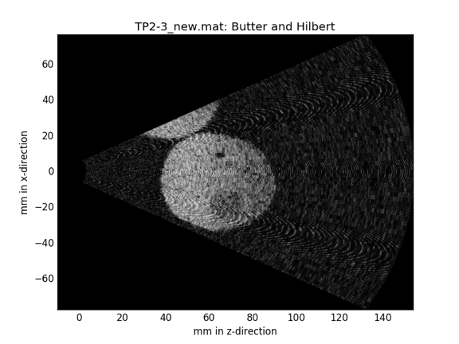
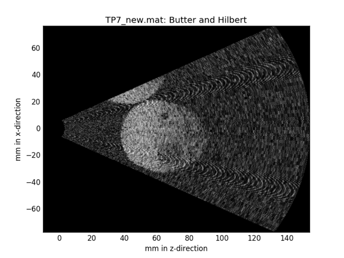

# Playing with raw data

## Setup

The fantom in da place

The raw image

The enveloppe-detected image

## Datasets

* [Normalized CSV file of the enveloppe](2016-07-06/tp7-enveloppe.csv.bz2)
* [Normalized CSV file of the raw signal](2016-07-06/tp2-rawsignal.csv.bz2)

In the classical format

## Challenge

How can you make the image better ?

