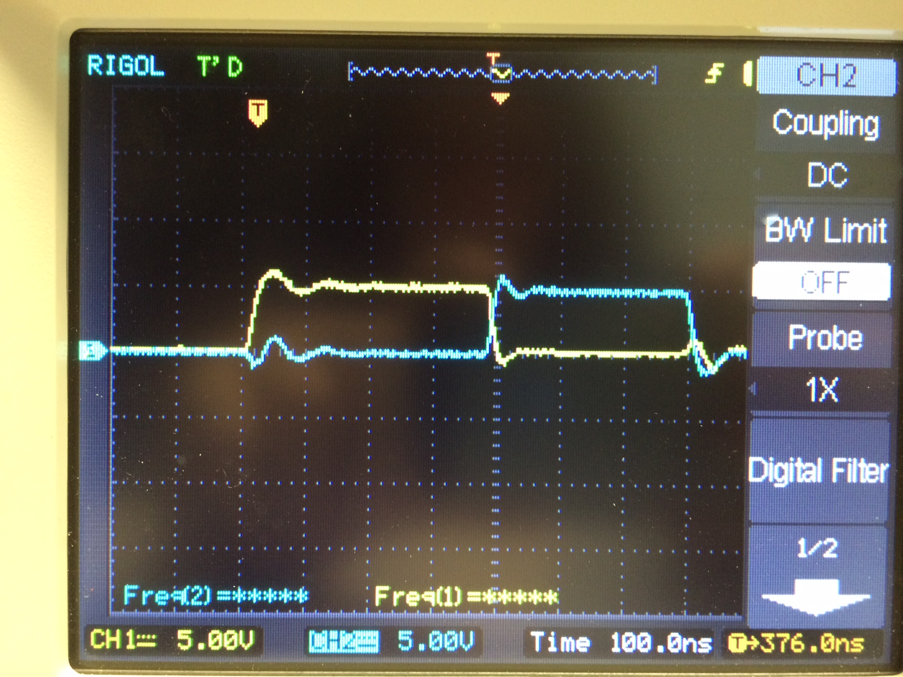
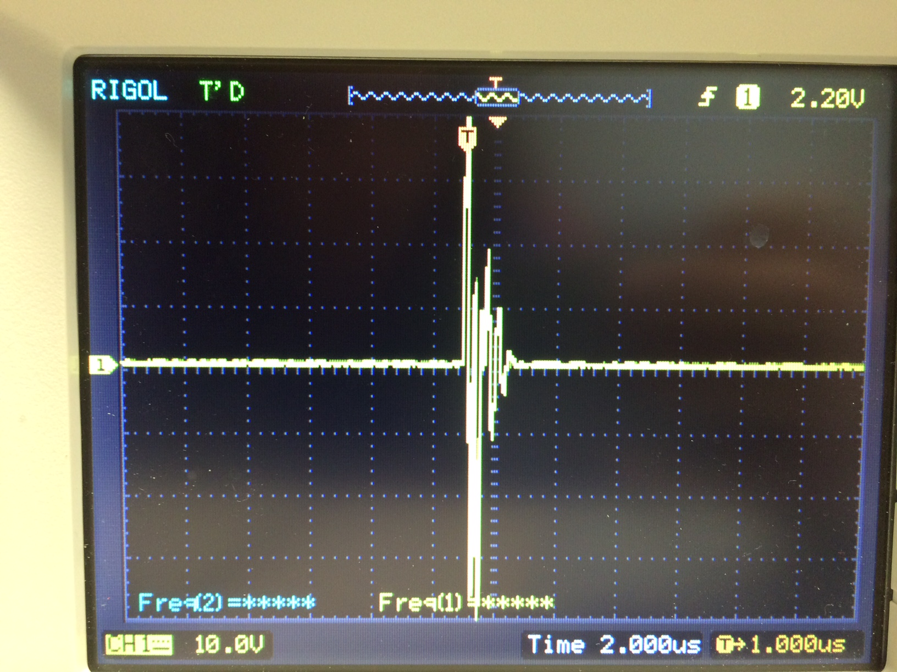

### 2016-06-07 

#### Log

I powered the board off the Arduino:

I sent the two 5V pulses from the Arduino:

I connected those two pulses to the Murgen board to get the resulting wave (in yellow; the positive edge of the Arduino pulse is in blue):

Here was my issue though... when I connected to the transducer via SMA and tried to read echoes off of TP1, I only got the one pulse; no echoes: 

Having been able to follow the other steps smoothly I'm not sure what went wrong here... I'm using a 50-ohm load transducer.

#### Answer

Looks good. You would be using an arduino that is slower than the trinket pro, hence peaks wider than what I got. You can try to remove one NOP from the arduino to get narrower ones.
That being said, I note that you're using HV of more than 50V. I'd recommend lowering it to ~40V for the tests, indeed the MD0100 gets sensitive at ~90V. A simple flat screwdriver on P1 controls this voltage, try to lower it.

To get the echoes, what is your setup in terms of piezo? What is its frequency / focal zone? Is it immerged? If so, can you make sure that a reflector is put parallel to the transducer face at its focal zone?
It is a bit tricky to get these first echoes, but if you have it set up correctly, echoes should appear at some t (2 * focaldistance/speedofwaves)s (I got mine at ~10cm, that was 2*0.1/1500 = 133us).

Two last remark before night comes, is that powering the board should ideally be done through an alternative power supply, at least to keep the "cleanliness" of the 5V and 3.3V supplies - those are cheap, and useful, so don't hesitate to get one.
The other one is that it's somehow better to get an insulation between the board and the table .. usually a plastic sheet, or anything non conducting.. that avoids shorts which happen when the table is even slightly conducting.

Keep up with the progress, with the last items you should be able to get the first echoes very very soon!!

When that does happen, take the measurement between the pair of TP just behind of the TGC (AD8331), this is where the signal will be the cleaner.

